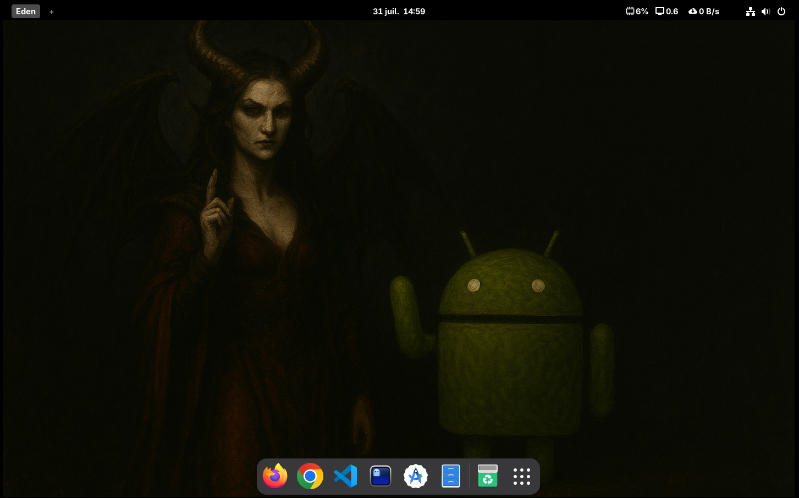

# Download and install

Download the NixOS ISO from:
https://channels.nixos.org/nixos-25.05/latest-nixos-graphical-x86_64-linux.iso

Install it, then open a terminal and run:  
Default user:mdp xophidia:xophidia  

```
sudo -i
curl -sL https://raw.githubusercontent.com/xophidia/LilithOS/refs/heads/master/setup.sh | bash
reboot
```

The full installation takes about ten minutes.

# Overview

Lilith OS is a free and open-source GNU/Linux distribution built on top of NixOS. Rather than including a wide array of standard tools, it favors a modular and customized approach, focused on environment isolation, system reproducibility, and a carefully selected set of tools tailored to the user's actual needs. It also aims to simplify Android malware analysis by integrating clear and accessible educational resources.

Designed from the ground up to be lightweight and optimized, Lilith OS strives to exclude any unnecessary services or modules in order to maximize performance while minimizing system footprint.

NixOS offers a solid foundation :

- **Declarative configuration**: The entire system is configured through files, making management, reproduction, and versioning straightforward.

- **Guaranteed reproducibility**: Each environment is identical when using the same configurations, reducing errors caused by setup differences.

- **Advanced package management**: Thanks to the Nix package manager, dependencies are isolated, preventing software conflicts.

- **Safe updates and rollback**: Updates are atomic, and it’s easy to revert to a previous version if issues arise.

- **Environment isolation**: Each package is installed in a separate environment, enhancing stability and security.

- **Suitable for complex environments**: Ideal for developers, system administrators, and scenarios requiring high reliability.

- **Flexibility and customization**: Easily adaptable to various use cases due to modularity and detailed configurations.

⚠️ Warning / Avertissement
As of today, this project is currently in the customization phase of NixOS and does not yet provide any ISO or other export formats.
Please note that the system is under active development and not ready for production use.

# Structure
```
In the $HOME directory:

$HOME
└── scripts/
    └── redroid.sh # start and stop redroid emulator
```

# Tools

NixOS : 25.11  
HomeManager : 25.05

| Category    | Name     | Comments     |
|---------------|---------------|---------------|
| Static analysis    | apktool<br>jadx<br>apkid<br>sqlite<br>vscode     | plugins: java-pack, gradle, python  |
| Dynamic analysis | frida-tools<br>genymotion<br>ghidra<br>radare2+Cutter<br>Redroid (Docker)   | plugins: gnudisassembler |
| Common | docker<br>docker-compose<br>jdk24<br>android-studio<br>android-tools<br>Python3.14||

Complete list of available applications here.

# Preview


